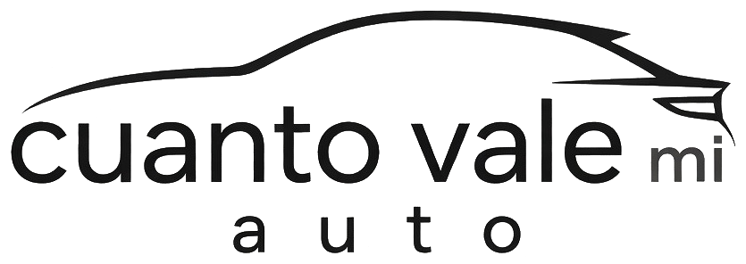

<div align="center">

<picture>
  <source media="(prefers-color-scheme: dark)" srcset="frontend/public/logo-dark.png">
  
</picture>

# Cuánto vale mi auto

### ¿Cuánto vale tu auto? Escribí marca, modelo y año — y enterate.

Valuador automático de autos usados argentinos basado en **publicaciones reales**,
estadística robusta y un motor de **comparables ponderados**. Sin IA externa, sin APIs pagas, sin humo.

[**🇬🇧 Read in English**](README.en.md) · [**🚀 Demo en vivo**](#-demo) · [**✨ Features**](#-qué-hace) · [**🧠 Cómo funciona**](#-cómo-funciona-por-dentro)


</div>

---

## 🎯 El problema

En Argentina, saber cuánto vale un auto usado es un caos: precios en pesos y dólares,
anticipos disfrazados de precio, versiones con nombres distintos según el sitio y
mercados que cambian todas las semanas. Las "guías" quedan viejas y los tasadores cobran.

**Cuánto vale mi auto** responde una sola pregunta, con datos de hoy:

> **Volkswagen Gol Trend 2017 → $14.000.000 — $17.460.000**

---

## ✨ Qué hace

- 🔍 **Scraping real multi-fuente** — Mercado Libre, Autocosmos, Kavak, DeMotores (adaptadores independientes, si una fuente cae las demás siguen).
- ⚖️ **Valuación por comparables** — cada publicación recibe un peso de similitud (modelo × año × versión × kilometraje). Nada de promedios crudos.
- 📈 **Búsqueda progresiva** — si hay pocos datos exactos, amplía a años cercanos, re-busca sin año y relaja filtros opcionales antes de rendirse.
- 💱 **ARS + USD** — conversión con dólar oficial en vivo (DolarAPI, gratuita), siempre declarada.
- 🚗 **0 km y usados** — búsqueda 0 km con comparables priorizados; filtros opcionales de kilometraje y versión que ponderan, nunca excluyen.
- 📊 **Estadística honesta** — mediana/promedio/P10–P90 ponderados, outliers por IQR/MAD, ajuste temporal Theil-Sen, nivel de confianza explicable.
- ♿ **Accesible de verdad** — contraste alto, tipografía grande, botones ≥48px, navegación por teclado, modo claro/oscuro, 100% español simple.

---

## 🚀 Demo

👉 **Próximamente en Render** (deploy automático desde `main` con el `render.yaml` incluido).

O corrélo local en 2 comandos:

```bash
npm install
npm run dev
```

Abrí 👉 http://localhost:5173 → probá `Volkswagen Gol Trend 2017`.

---

## 🧠 Cómo funciona (por dentro)

```
Usuario: marca + modelo + año (+ filtros opcionales)
  ↓
LEVEL 1 · Búsqueda exacta en todas las fuentes
  ↓ ¿Alcanzan los comparables?
  NO ↓
LEVEL 2-3 · Re-búsqueda amplia (modelo sin año, más páginas)
  ↓
LEVEL 4-5 · Scoring de similitud + ajuste temporal/km + outliers + stats ponderadas
  ↓
LEVEL 6 · Relajación de filtros opcionales (avisada, nunca silenciosa)
  ↓
Estimación + confianza + metodología transparente (objeto debug en la API)
```

**Regla de oro**: la falta de publicaciones idénticas **no** significa que no se pueda estimar.
Solo se dice "sin datos suficientes" cuando no hay nada ni siquiera con comparables.

---

## 🛠️ Stack

| Capa | Tecnologías |
|---|---|
| Frontend | React 19 · TypeScript · Vite · CSS con tokens (light/dark) |
| Backend | Node.js · Express · TypeScript estricto · Zod |
| Datos | Scraping HTTP + JSON-LD (sin browser) · SQLite (caché) |
| Calidad | 27 tests (unit + fixtures HTML reales) · builds verificados |

**Todo gratuito**: cero APIs pagas, cero proxies, cero LLMs. La inteligencia es código determinístico.

---

## 📁 Estructura

```
frontend/          # React + Vite (UI accesible, ES simple)
backend/
  src/scrapers/    # Un adaptador por fuente (CarDataSource)
  src/services/    # comparables · timeAdjust · mileageAdjust · statistics · confidence
  fixtures/        # HTML reales para tests sin internet
Dockerfile + render.yaml  # Deploy en un click
```

Agregar una fuente = una clase + una línea en `registry.ts`. Sin tocar el núcleo.

---

## 👤 Autor

**Franco Polesel** — [✉ Email](mailto:francopolesel99@gmail.com) · [GitHub](https://github.com/francopolesel) · [LinkedIn](https://ar.linkedin.com/in/franco-paul-polesel)
